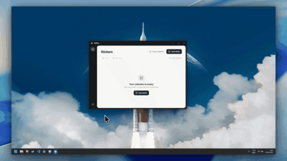

# Wallies

<h3 align="center">Animated stickers for your desktop</h3>

<p align="center">
  <a href="https://github.com/iBManu/wallies/releases"></a>
  <a href="https://github.com/iBManu/wallies/releases"></a>
</p>

<p align="center">
  
</p>

> [!IMPORTANT]
> Wallies is under active development. The app is functional, but you may encounter bugs or platform-specific limitations. Issue reports are welcome.

## Features

**Wallies** lets you place images and animated GIFs on your desktop as independent, transparent windows. Each sticker can be moved, resized, edited, or hidden without affecting the others.

Key features include:

- **Flexible imports** – Add PNG, JPG, WEBP, GIF, and SVG files, paste an image URL, or search GifCities and Wikimedia Commons.
- **Desktop controls** – Drag and resize stickers, keep them above other windows, or let clicks pass through to the window underneath.
- **Sticker editing** – Crop an image, remove a background color, adjust opacity, rotate or flip it, and change GIF playback speed.
- **Collections** – Organize stickers into groups and show or hide them together.
- **Local storage** – Imported files and sticker settings are saved locally and restored when the app starts.
- **System tray** – Manage the app without keeping the library window open.
- **Multiple languages** – English, Spanish, German, Simplified Chinese, Japanese, Portuguese, Italian, and French.

## Usage

1. Open the app and select **Add Sticker**, or drag an image into the library. You can also add a URL or search for a GIF online.
2. Use **Edit Stickers** in the app or tray menu to move and resize stickers on the desktop. Open a sticker's three-dot menu to change its properties.
3. Drag stickers into collections in the library. Show or hide individual stickers or entire collections as needed.
4. Use the tray icon to reopen the library. Positions and settings are saved automatically.

Imported files are copied into the app's local data directory (`%APPDATA%\Wallies` on Windows), so the originals do not need to remain in place.

## Getting Started

### Download a release

Open the [Releases](https://github.com/iBManu/wallies/releases) page, choose the latest release, and download the file for your operating system from **Assets**:

- **Windows:** `.exe` or `.msi` installer.
- **macOS:** `.dmg` package.
- **Linux:** `.deb` package or `.AppImage`, depending on the release assets.

Run the installer or open the downloaded package. An AppImage may need executable permission. Windows and macOS builds are not yet signed or notarized, so your system may display a warning.

If no installer is attached to the release, you can build the app from source instead.

### Build from source

#### Prerequisites

- Node.js 20 or later, including npm.
- Rust and Cargo (stable toolchain).
- The [Tauri 2 system prerequisites](https://v2.tauri.app/start/prerequisites/) for your platform. Windows requires MSVC C++ Build Tools and WebView2; Linux requires WebKitGTK and AppIndicator development libraries. On macOS, install the Xcode command-line tools.

Check your installed tools:

```bash
node -v
npm -v
rustc --version
cargo --version
```

Clone the repository, enter its directory, and install dependencies:

```bash
git clone https://github.com/iBManu/wallies.git
cd wallies
npm ci
```

The Tauri CLI is included as a project dependency; a global installation is not required.

Build the app and its installers:

```bash
npm run tauri build
```

The executable is generated in `src-tauri/target/release/` and installers in `src-tauri/target/release/bundle/`. Cross-compilation targets may use a target-specific directory.

### Development Mode

To run the app without building installers:

```bash
npm run tauri dev
```

## Technologies

- **Tauri 2 and Rust** – Native sticker windows, system tray, operating-system integration, and persistence.
- **React, TypeScript, and Vite** – Library and editing interface.
- **Local app data** – Imported images and settings are stored on your device, without an account.

## Credits

- [Inter](https://github.com/rsms/inter) is the interface font. Its copyright notice and full [SIL Open Font License 1.1](public/Inter-OFL.txt) are included with the project.
- [emoji-picker-element](https://github.com/nolanlawson/emoji-picker-element) provides the collection emoji picker.
